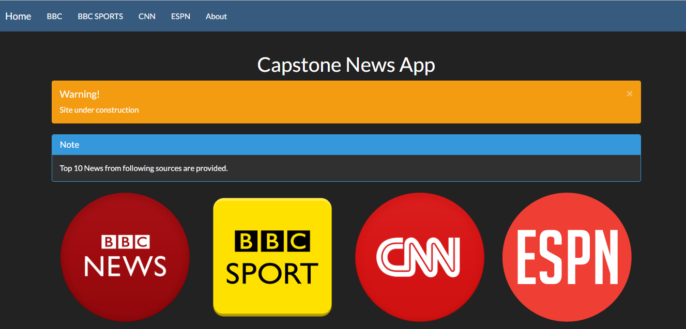
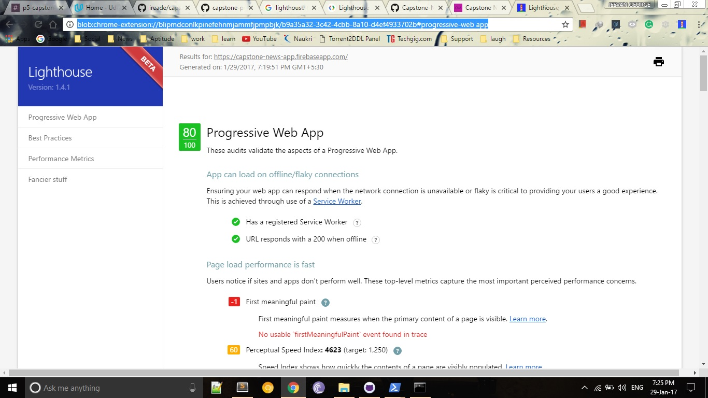

# capstone-news-app

This README outlines the details of collaborating on this Ember application.
A short introduction of this app could easily go here.

For this final Project of Senior Web Developer Nanodegree Program, I chose a web app to be developed that could deliver news from various sources using [News Api](https://newsapi.org/ "News API"). 

## Demo site
* https://capstone-news-app.firebaseapp.com/

## Lighthouse report
Scored **80/100** on Lighthouse -

## Features
* Live News using [News Api](https://newsapi.org/ "News API")
* Offline functionality - implemented using broccoli-serviceworker and localstorage
* Push notification - native feature implemented using ember-cli-push-js-shim

## References
* http://www.netosober.io/bootstrap/emberjs/embercli/2015/07/16/emberjs-styling-wtih-bootstrap/
* http://tutorialzine.com/2016/09/everything-you-should-know-about-progressive-web-apps/
* http://kiprosh.com/blog/launch-your-website-as-mobile-web-application
* https://tsubik.com/blog/make-your-emberjs-web-app-more-progressive-part-1/
* http://stackoverflow.com/questions/41886188/how-to-store-retrieve-and-delete-data-using-ember-data
* http://vaughnroyko.com/saving-and-loading-objects-or-arrays-in-localstorage/

##Resources
* http://www.favicon-generator.org/   for icon generation

## Prerequisites

You will need the following things properly installed on your computer.

* [Git](https://git-scm.com/)
* [Node.js](https://nodejs.org/) (with NPM)
* [Bower](https://bower.io/)
* [Ember CLI](https://ember-cli.com/)
* [PhantomJS](http://phantomjs.org/)

## Installation

* `git clone <repository-url>` this repository
* `cd capstone-news-app`
* `npm install`
* `bower install`

## Running / Development

* `ember serve`
* Visit your app at [http://localhost:4200](http://localhost:4200).

### Code Generators

Make use of the many generators for code, try `ember help generate` for more details

### Running Tests

* `ember test`
* `ember test --server`

### Building

* `ember build` (development)
* `ember build --environment production` (production)

### Deploying

Specify what it takes to deploy your app.

## Further Reading / Useful Links

* [ember.js](http://emberjs.com/)
* [ember-cli](https://ember-cli.com/)
* Development Browser Extensions
  * [ember inspector for chrome](https://chrome.google.com/webstore/detail/ember-inspector/bmdblncegkenkacieihfhpjfppoconhi)
  * [ember inspector for firefox](https://addons.mozilla.org/en-US/firefox/addon/ember-inspector/)
